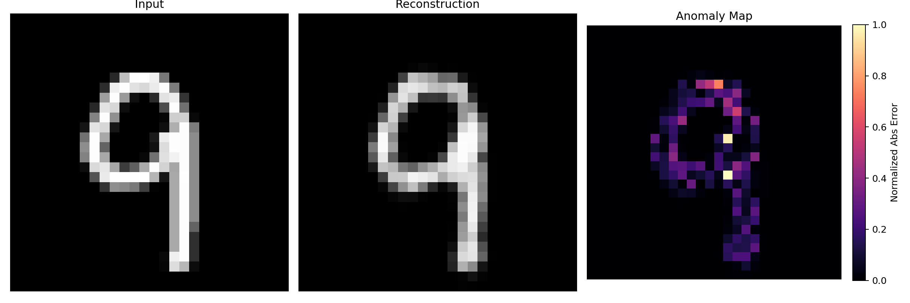

# AnomalyMap: Unsupervised Defect Detection via Autoencoders

> **Unsupervised** anomaly/defect detection using a lightweight **convolutional autoencoder (AE)** trained only on *normal* MNIST digits. The model reconstructs “healthy” samples well and struggles on out-of-distribution digits, enabling anomaly detection via **pixel‑wise reconstruction error**. Includes evaluation, visual heatmaps (“Anomaly Maps”), and optional latent‑space visualization with t‑SNE.

<p align="center">
  
</p>

---

## 🔥 Highlights
- **End‑to‑end pipeline**: data prep → training → evaluation → heatmaps → latent‑space viz
- **GPU‑optimized training** with optional **AMP** (automatic mixed precision)
- **Clean, modular scripts** for clarity and reproducibility
- **No labels required** for anomalies; treats digit **9** as the “defect” class by default
- **Readable outputs**: per‑image error CSV, histograms, heatmaps, 2‑D latent scatter

---

## 🗂️ Project Structure

```
AnomalyMap/
├── data/                        # MNIST raw + processed tensors (.pt)
│   ├── train_normal.pt
│   ├── test_normal.pt
│   └── test_anomaly.pt
│
├── models/
│   ├── __init__.py
│   └── autoencoder.py           # convolutional autoencoder (encoder + decoder)
│
├── scripts/
│   ├── 01_prepare_data.py       # download & split MNIST (0–8 normal, 9 anomaly)
│   ├── 02_train_autoencoder.py  # GPU‑ready AE training with optional AMP
│   ├── 03_evaluate_anomalies.py # per‑image reconstruction error + histogram
│   ├── 04_visualize_heatmaps.py # [input | recon | heatmap] triptychs
│   └── 05_latent_viz.py         # (optional) t‑SNE of encoder latents
│
├── utils/
│   ├── __init__.py
│   └── helpers.py               # (placeholder for shared utilities)
│
├── results/
│   ├── training_loss_plot.png
│   ├── error_histogram.png
│   ├── latent_space_tsne.png
│   ├── reconstruction_errors.csv
│   └── heatmaps/
│       ├── sample_1.png
│       └── ...
│
├── requirements.txt
└── README.md
```

---

## 🧰 Environment & Installation

> Tested with **Python 3.11+**, **PyTorch 2.3+**, **CUDA 12.x** (optional).

```bash
# 1) Create/activate a virtual environment (recommended)
python -m venv .venv
# Windows PowerShell
. .venv/Scripts/Activate.ps1
# macOS/Linux
source .venv/bin/activate

# 2) Install deps
pip install -r requirements.txt
```

**Minimal requirements (example):**
```txt
torch>=2.2
torchvision>=0.17
matplotlib>=3.7
numpy>=1.24
scikit-learn>=1.3
```
> If you want GPU acceleration, install the CUDA‑enabled build of PyTorch per the official instructions for your CUDA version.

---

## ⚙️ Pipeline: Step‑by‑Step

### 1) Prepare Data
Downloads MNIST, normalizes to `[0,1]`, and splits:
- **Normal**: digits `0–8`
- **Anomaly**: digit `9`

```bash
python scripts/01_prepare_data.py
# Optional args:
# --normal 0 1 2 3 4 5 6 7 8  --anomaly 9  --data-dir data
```

**Outputs**
- `data/train_normal.pt`
- `data/test_normal.pt`
- `data/test_anomaly.pt`

---

### 2) Train the Autoencoder
Trains AE on **normal** images only (MSE loss). GPU + AMP enabled by default (if available).

```bash
# Auto-selects CUDA if available; AMP on by default
python scripts/02_train_autoencoder.py

# Force CUDA / CPU, tweak hparams:
python scripts/02_train_autoencoder.py --device cuda --epochs 5 --batch-size 256 --lr 1e-3 --latent-dim 64
python scripts/02_train_autoencoder.py --device cpu --no-amp
```

**Outputs**
- `models/autoencoder.pth` (weights)
- `results/training_loss_plot.png`

---

### 3) Evaluate Reconstruction Errors
Computes **per‑image MSE** on test **normal** vs **anomaly** splits, and draws histograms.

```bash
python scripts/03_evaluate_anomalies.py           # auto device
python scripts/03_evaluate_anomalies.py --device cuda  # force GPU
```

**Outputs**
- `results/reconstruction_errors.csv` (columns: split, index, label, mse)
- `results/error_histogram.png`

**Typical outcome (example)**  
Mean MSE (lower is better):
```
normal  ≈ 0.0059
anomaly ≈ 0.0067
```
Anomalies (unseen during training) reconstruct slightly worse → higher error.

---

### 4) Visualize Anomaly Heatmaps
For selected samples, saves `[input | reconstruction | heatmap]` triptychs where the heatmap is the **normalized absolute error**.

```bash
# default: 8 random anomalies, auto device
python scripts/04_visualize_heatmaps.py

# Force GPU + AMP
python scripts/04_visualize_heatmaps.py --device cuda

# Specific indices or use normals
python scripts/04_visualize_heatmaps.py --indices 3 10 42
python scripts/04_visualize_heatmaps.py --split normal --num 6

# Styling
python scripts/04_visualize_heatmaps.py --fig-scale 2.0 --cmap inferno
```

**Outputs**
- `results/heatmaps/sample_*.png`

---

### 5) (Optional) Latent Space Visualization
Extract encoder latents for both splits and project to 2‑D with **t‑SNE**.

```bash
# auto device
python scripts/05_latent_viz.py

# GPU + larger sample + tuned perplexity
python scripts/05_latent_viz.py --device cuda --max-per-split 4000 --perplexity 35 --seed 42
```

**Outputs**
- `results/latent_space_tsne.png`
- `results/latent_embeddings.csv`

---

## 🧠 Model: Convolutional Autoencoder

- **Encoder**: `Conv → ReLU → Conv → ReLU → MaxPool ×2 → Flatten → Linear(latent_dim)`  
  Downsamples from `28×28` to a compact latent vector (`latent_dim` ≈ 64 by default).

- **Decoder**: `Linear → Reshape → ConvTranspose ×2 → Conv(out=1) → Sigmoid`  
  Reconstructs an image in `[0,1]`. Training objective is **MSE** on pixels.

This simple AE is intentionally lightweight and ideal for **intro anomaly detection** demos. You can replace it with deeper or variational models if desired.

---

## 📊 Interpreting Results

- **Per‑image MSE**: primary anomaly score. Higher → more anomalous.
- **Histogram separation**: distributions of normal vs anomaly errors should show a gap.
- **Heatmaps**: regions with larger error → locations where the AE “fails” to reconstruct (defect cues).
- **t‑SNE**: shows how normal vs anomaly latents cluster; separation suggests learned structure.

---

## 🔬 Reproducibility Notes

- Scripts set a default `--seed`, but exact results may vary (GPU nondeterminism, cuDNN).
- Disable AMP or set deterministic flags for stricter reproducibility (with some slowdown).
- Command examples used in the reference run:
  ```bash
  python scripts/01_prepare_data.py
  python scripts/02_train_autoencoder.py --device cuda
  python scripts/03_evaluate_anomalies.py --device cuda
  python scripts/04_visualize_heatmaps.py --device cuda
  python scripts/05_latent_viz.py --device cuda
  ```

---

## 🛠️ Troubleshooting

- **MNIST 404 on old host**: TorchVision auto‑fallbacks to `ossci-datasets.s3.amazonaws.com`. No action needed.
- **CUDA not available**: Ensure your PyTorch build matches your CUDA version. Otherwise run with `--device cpu`.
- **AMP deprecation warnings**: Newer PyTorch prefers `torch.amp.autocast('cuda')` and `torch.amp.GradScaler('cuda')`. Scripts handle this.
- **Slow DataLoader on Windows**: keep `--num-workers 0` or increase cautiously; enable `pin_memory` on CUDA (already set).

---

## ✅ Roadmap Ideas
- Threshold selection (e.g., Otsu, percentile) for binary anomaly decisions
- PR‑AUC / ROC‑AUC using a held‑out validation set
- VAE or UNet‑style AE for richer reconstructions
- Grad‑CAM or attention maps for interpretability (on supervised variants)

---

## 📄 License
This repository is released under the **MIT License**. See `LICENSE` (add one if missing).

---

## 🙌 Citation
If this project helped you, please cite the repo:

```bibtex
@misc{anomalymap2025,
  title  = {AnomalyMap: Unsupervised Defect Detection via Autoencoders},
  author = {Vatsal},  # edit to your preference
  year   = {2025},
  url    = {https://github.com/Vatsal212005/AnomalyMap}
}
```

---

